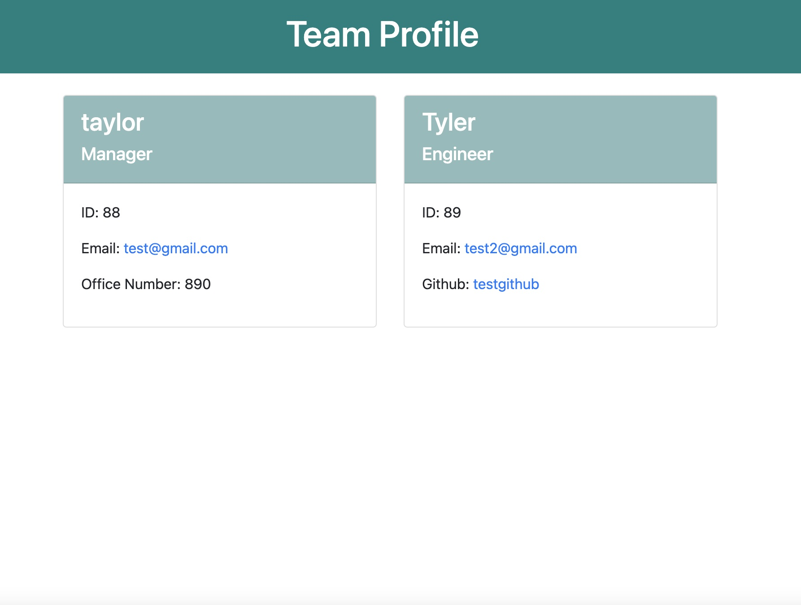
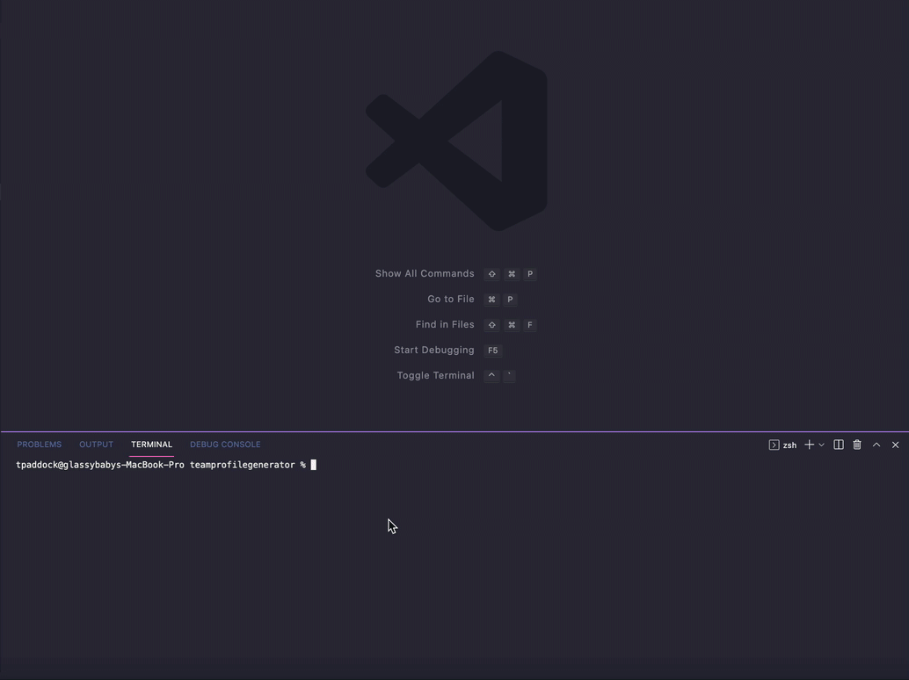

# teamprofilegenerator

## Description

Create a Node.js command-line application that takes in information about employees on a software engineering team, then generates an HTML webpage based on the information you entered about the Manager and their Engineers or Interns. 

## Installation

To install please clone this repository from GitHub and downloade Node. This application also require file system and inquirer module along with Jest for testing.

## Usage

In your integrated terminal, run 'npm i' and then 'node index.js' to run the application and answer the prompts to create your own team profile html.

## Tests

Run 'npm test' to run Jest for tests on constructors.

## Credits

Used hellp from UW BOOTCAMP week 10 OOP files.

## Questions

Reach out to me directly at <a href="mailto:tayjeep@comcast.net">tayjeep@comcast.net</a> or view the rest of my repositories.